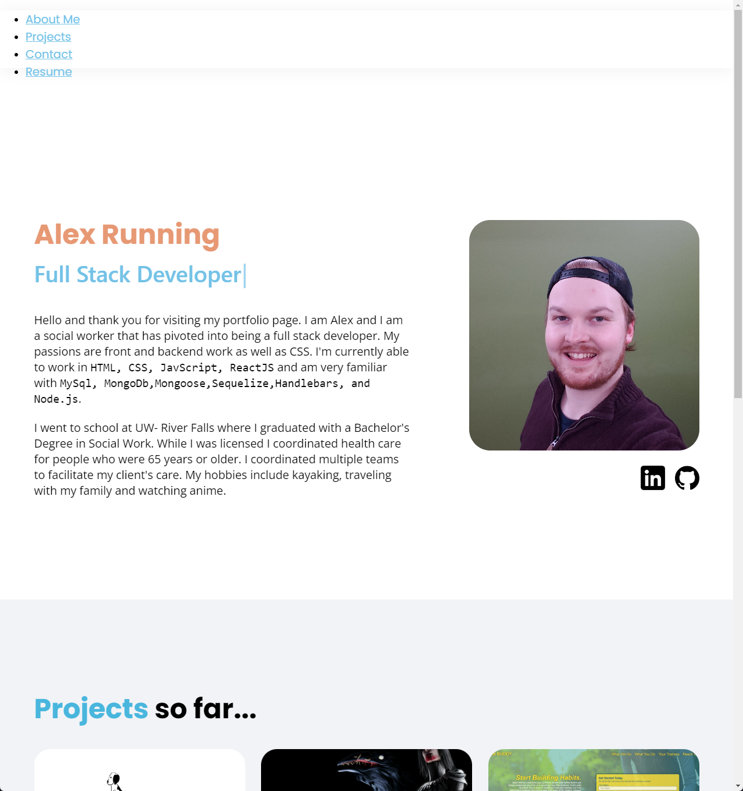

# React-Portfolio

This is my professional portfolio made with React.

## Table of Contents

- [Getting Started](#GettingStarted)
- [Description](#Description)
- [License](#license)
- [Aknowledgements](#aknowledgements)

## Getting Started
 * Visit [here](https://snowslurpie.github.io/react-portfolio/)

 

## Description
 * When you click on the website you will see my portfolio I have prepared. You will be able to see projects I am working on and/or have completed as well as review my resume.

 

## Author

**Alex Running** 

- [Link to Portfolio Site](https://snowslurpie.github.io/react-portfolio/)
- [Link to Github](https://github.com/SnowSlurpie)

## License

This project is licensed under the MIT License 

## Acknowledgments

* [W3 Schools](https://www.w3schools.com/)
* [MDN Web Docs](https://developer.mozilla.org/en-US/)
* [Stack Overflow](https://stackoverflow.com/)